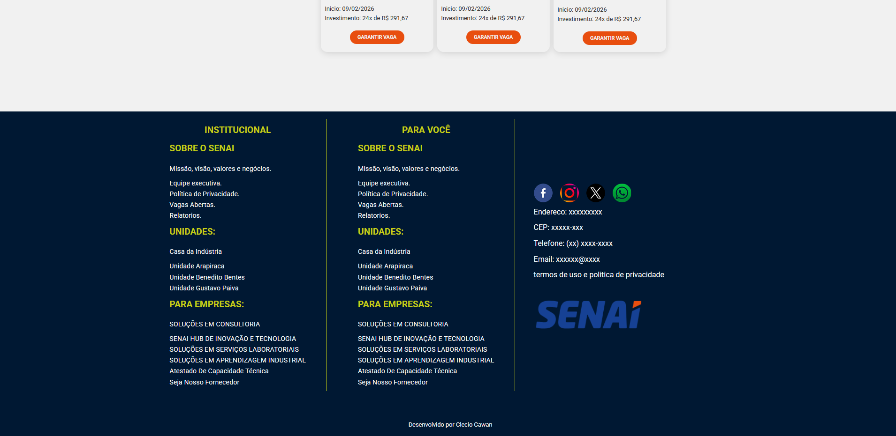

# Senai-Page

## 💻 Sobre o Projeto

> 🚀 O **SENAI Page** é uma página estática inspirada no site do **SENAI (Serviço Nacional de Aprendizagem Industrial)**.  
O foco do projeto é **reproduzir o design** e **aprimorar conhecimentos em front-end**, aplicando boas práticas de **responsividade**, **organização de código** e **componentização**.

Este projeto não possui fins comerciais e foi criado apenas **para fins educacionais**.

---

## 📸 Demonstração

  

  

  

[Site-Dreaming-Home](https://landing-page-homes.vercel.app/)

---

## 🚀 Tecnologias

As seguintes ferramentas e tecnologias foram utilizadas na construção do projeto:

#### **Frontend**
- HTML
- CSS

---

## 📝 Licença

Este projeto está sob a licença MIT. Veja o arquivo [LICENSE](LICENSE) para mais detalhes.

---

## 👨‍💻 Autor

Feito por **Clecio Cawan Laurentino Silva**.

